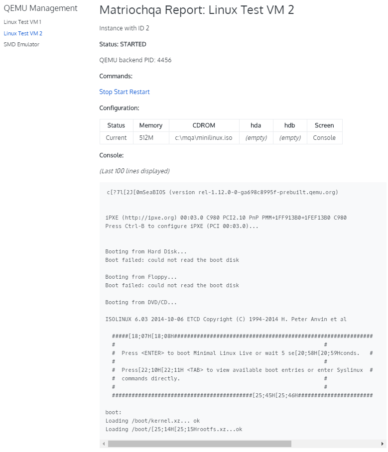

# matriochqa
A csv &amp; markdown front end for QEMU


## Requirements
- MS-Windows, for the moment - although it should work on Linux as well.
- Qt 5.12, no way to escape
- [Hugo](https://gohugo.io/) to render the server status pages into a browser.
- Hugo them [Book](https://github.com/alex-shpak/hugo-book). matriochqa may work with other themes, but I tested only this one.
- [QEMU](https://www.qemu.org/) of course

In addition, the following dependencies are linked as git submodules:
- [Fast C++ CSV Parser](https://github.com/ben-strasser/fast-cpp-csv-parser), a nice templated CSV parsing library

## Build
As usual:
```
qmake matriochqa.pro
make
```

## Configure
Typical configuration file:
```
[%General]
base_vm_dir=C:/mqa/tmp
instance_config=C:/mqa/etc/vm.csv
new_instances_start_immediatly=true

[qemu]
base_qemu_dir=C:/Program Files/qemu
exec\x86_64=qemu-system-x86_64.exe

[markdown]
hugo_content_dir=C:/mqa/hugo/content
hugo_port=1313
mq_root=/
mq_instances_path=/docs/
content_console_depth=100
content_logbook_depth=30

[command_server]
address=127.0.0.1
port=4455
```
Software will look for `matriochqa.ini` in current directory.
Path to configuration file can be overloaded with command line option `-c <path_to_ini>`.

## Status

**NOT FUNCTIONAL, WORKING ON IT !**
